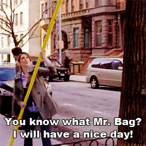
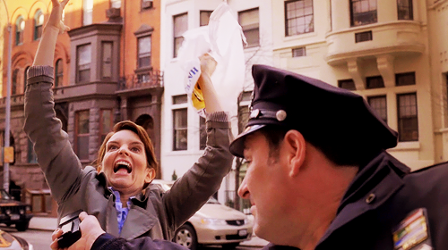

## **"Plarn"** is "yarn" made from plastic bags, like grocery shopping bags. 

<table border=1>
	<tr>
		<td>
			
		</td>
		<td>
			
		</td>	
	</tr>
</table>

### Backstory
I can't remember when I first came across this but I'm guessing it's been more than five years. I started looking into it again because I have so. freaking. many. plastic bags now. After living in places that banned plastic bags years ago, it's weird to see them again here in Memphis. Also, with the pandemic, I can't always use my own reusable bags and grocery delivery here comes in all plastic! I don't even think I've seen paper bags anywhere??

### Methods
Different people have different methods creating plarn but all involve cutting a plastic bag into one or more thin strips and connecting those together to make a long thread of plastic.

#### Connect loops of plastic
2 minute YT video on this method by [needlepointers](https://www.youtube.com/watch?v=gQwTcizA7Oo)

YouTube showed me some people call the strips tied together "plarn roving," which I have feelings about. But whatever, you spin your plastic into cording or whatever you want, you crafty folks.

<small>Created November 29, 2021</small>